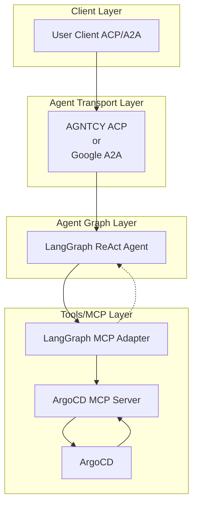

# 🚀 ArgoCD AI Agent

[](https://www.python.org/)
[](https://python-poetry.org/)
[](LICENSE)

[](https://github.com/cnoe-io/openapi-mcp-codegen/actions/workflows/conventional_commits.yml)
[](https://github.com/cnoe-io/openapi-mcp-codegen/actions/workflows/ruff.yml)
[](https://github.com/cnoe-io/openapi-mcp-codegen/actions/workflows/superlinter.yml)

## 🧪 Evaluation Badges

| Claude | Gemini | OpenAI | Llama |
|--------|--------|--------|-------|
| [](https://github.com/cnoe-io/agent-argocd/actions/workflows/claude-evals.yml) | [](https://github.com/cnoe-io/agent-argocd/actions/workflows/gemini-evals.yml) | [](https://github.com/cnoe-io/agent-argocd/actions/workflows/openai-evals.yml) | [](https://github.com/cnoe-io/agent-argocd/actions/workflows/openai-evals.yml) |
---
- 🤖 **ArgoCD Agent** is an LLM-powered agent built using the [LangGraph ReAct Agent](https://langchain-ai.github.io/langgraph/agents/agents/) workflow and [MCP tools](https://modelcontextprotocol.io/introduction).
- 🌐 **Protocol Support:** Compatible with [ACP](https://github.com/agntcy/acp-spec) and [A2A](https://github.com/google/A2A) protocols for integration with external user clients.
- 🛡️ **Secure by Design:** Enforces ArgoCD API token-based RBAC and supports external authentication for strong access control.
- 🔌 **Integrated Communication:** Uses [langchain-mcp-adapters](https://github.com/langchain-ai/langchain-mcp-adapters) to connect with the ArgoCD MCP server within the LangGraph ReAct Agent workflow.
- 🏭 **First-Party MCP Server:** The MCP server is generated by our first-party [openapi-mcp-codegen](https://github.com/cnoe-io/openapi-mcp-codegen/tree/main) utility, ensuring version/API compatibility and software supply chain integrity.

---

## 🏗️ Architecture



---

## ✨ Features

- 🤖 **LangGraph + LangChain MCP Adapter** for agent orchestration
- 🧠 **Azure OpenAI GPT-4o** as the LLM backend
- 🔗 Connects to ArgoCD via a dedicated [ArgoCD MCP agent](https://github.com/severity1/argocd-mcp)
- 🔄 **Multi-protocol support:** Compatible with both **ACP** and **A2A** protocols for flexible integration and multi-agent orchestration

#### Step 1. Create/Update `.env`

```
LLM_PROVIDER=`azure-openai`
AZURE_OPENAI_API_KEY=<COPY YOUR AZURE OPENAI API KEY>
OPENAI_API_VERSION=<COPY YOUR AZURE OPENAI API VERSION>
AZURE_OPENAI_API_VERSION=<COPY YOUR AZURE OPENAI API VERSION>
AZURE_OPENAI_DEPLOYMENT=<COPY YOUR AZURE OPENAI DEPLOYMENT>
AZURE_OPENAI_ENDPOINT=<COPY YOUR AZURE OPENAI ENDPOINT>
ARGOCD_TOKEN=<COPY YOUR ARGOCD SERVICE ACCOUNT TOKEN>
ARGOCD_API_URL=<COPY YOUR ARGOCD API ENDPOINT. Example https://argocd.exmaple.com/api/v1>
ARGOCD_VERIFY_SSL=<SET ARGOCD SSL VERIFICATION. true | false>
```

### 2️⃣ Start Workflow Server (ACP or A2A)

You can start the workflow server in either ACP or A2A mode:

- **ACP Mode:**

  ```bash
  make run-acp
  ```

- **A2A Mode:**

  ```bash
  make run-a2a
  ```

---

## 🧪 Usage

### ▶️ Test with ArgoCD Client

Update a `.env` file in the project root with the following content:

1. **Add Environment Variables to `.env`**

   Create or update a `.env` file in the project root:

   ```env
   AGENT_ID="<YOUR_AGENT_ID>"
   API_KEY="<YOUR_API_KEY>"
   WFSM_PORT="<YOUR_ACP_SERVER_PORT>"
   ```

2. **Run the Client**

  - For **ACP mode**:
    ```bash
    make run-acp-client
    ```
  - For **A2A mode**:
    ```bash
    make run-a2a-client
    ```
   **Sample Output:**

   ```
   > Your Question: how can you help?
   Agent: I can assist you with managing applications in ArgoCD, including tasks such as:
   ```

   ```
   1. **Listing Applications**: Retrieve a list of applications with filtering options.
   2. **Getting Application Details**: Fetch detailed information about a specific application.
   3. **Creating Applications**: Create new applications in ArgoCD.
   4. **Updating Applications**: Update existing applications.
   5. **Deleting Applications**: Remove applications from ArgoCD.
   6. **Syncing Applications**: Synchronize applications to a specific Git revision.
   7. **Getting User Info**: Retrieve information about the current user.
   8. **Getting ArgoCD Settings**: Access server settings.
   9. **Getting Plugins**: List available plugins.
   10. **Getting Version Information**: Retrieve ArgoCD API server version.
   ```

### ▶️ Test with Curl

1. **Get `AGENT_ID`, `API_KEY`, and `PORT`**

   When running `wfsm deploy`, look for output like:

   ```
   INF Agent ID: bc123..
   INF API Key: xyz456...
   INF ACP agent running on: http://127.0.0.1:56504
   ```

   Set them as environment variables:

   ```bash
   export AGENT_ID="<YOUR_AGENT_ID>"
   export API_KEY="<YOUR_API_KEY>"
   export WFSM_PORT="<YOUR_ACP_SERVER_PORT>"
   ```

2. **Send a Request**

   ```bash
   curl -s -H "Content-Type: application/json" \
    -H "x-api-key: $API_KEY" \
    -d '{
        "agent_id": "'"$AGENT_ID"'",
        "input": {
        "argocd_input": {
          "messages": [
          {
            "type": "human",
            "content": "Get version information of the ARGO CD server"
          }
          ]
        }
        },
        "config": {
        "configurable": {}
        }
      }' \
    http://127.0.0.1:$WFSM_PORT/runs/wait
   ```

---

## 🧬 Internals

- 🛠️ Uses [`create_react_agent`](https://docs.langchain.com/langgraph/agents/react/) for tool-calling
- 🔌 Tools loaded from the **ArgoCD MCP server** (submodule)
- ⚡ MCP server launched via `uv run` with `stdio` transport
- 🕸️ Single-node LangGraph for inference and action routing

---

## 📁 Project Structure

```text
agent_argocd/
│
├── agent.py              # LLM + MCP client orchestration
├── langgraph.py          # LangGraph graph definition
├── __main__.py           # CLI entrypoint
├── state.py              # Pydantic state models
└── argocd_mcp/           # Git submodule: ArgoCD MCP server

client/
└── client_agent.py       # Agent ACP Client
```

---

## 🧩 MCP Submodule (ArgoCD Tools)
This project uses a **first-party MCP module** generated from the ArgoCD OpenAPI specification using our [openapi-mcp-codegen](https://github.com/cnoe-io/openapi-mcp-codegen/tree/main/examples) utility. The generated MCP server is included as a git submodule in `argocd_mcp/`.

All ArgoCD-related LangChain tools are defined by this MCP server implementation, ensuring up-to-date API compatibility and supply chain integrity.

## 🔌 MCP Integration

The agent uses [`MultiServerMCPClient`](https://github.com/langchain-ai/langchain-mcp-adapters) to communicate with MCP-compliant services.

**Example (stdio transport):**

```python
async with MultiServerMCPClient(
  {
    "argocd": {
      "command": "uv",
      "args": ["run", "/abs/path/to/argocd_mcp/server.py"],
      "env": {
        "ARGOCD_TOKEN": argocd_token,
        "ARGOCD_API_URL": argocd_api_url,
        "ARGOCD_VERIFY_SSL": "false"
      },
      "transport": "stdio",
    }
  }
) as client:
  agent = create_react_agent(model, client.get_tools())
```

**Example (SSE transport):**

```python
async with MultiServerMCPClient(
  {
    "argocd": {
      "transport": "sse",
      "url": "http://localhost:8000"
    }
  }
) as client:
  ...
```

---

## 📜 License

Apache 2.0 (see [LICENSE](./LICENSE))

---

## 👥 Maintainers

See [MAINTAINERS.md](MAINTAINERS.md)

- Contributions welcome via PR or issue!

---

## 🙏 Acknowledgements

- [LangGraph](https://github.com/langchain-ai/langgraph) and [LangChain](https://github.com/langchain-ai/langchain) for agent orchestration frameworks.
- [langchain-mcp-adapters](https://github.com/langchain-ai/langchain-mcp-adapters) for MCP integration.
- [AGNTCY Agent Connect Protocol(ACP)](https://docs.agntcy.org/pages/syntactic_sdk/connect.html)
- [AGNTCY Agent Gateway Protocol(AGP)](https://docs.agntcy.org/pages/messaging_sdk/agp-howto.html)
- [AGNTCY Workflow Server Manager (WFSM)](https://github.com/agntcy/workflow-srv-mgr) for deployment and orchestration.
- [Model Context Protocol (MCP)](https://modelcontextprotocol.io/) for the protocol specification.
- [Google A2A](https://github.com/google/A2A/tree/main)
- The open source community for ongoing support and contributions.
